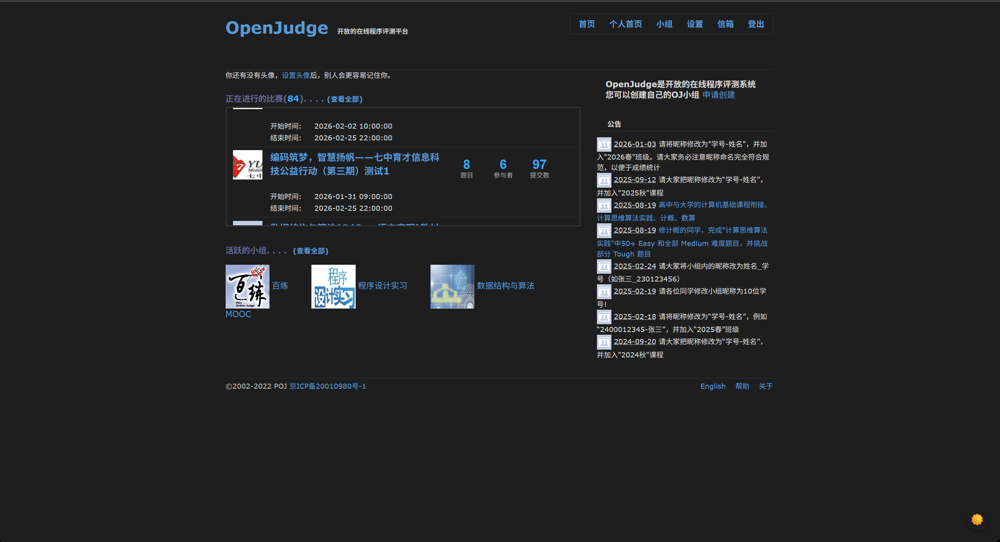
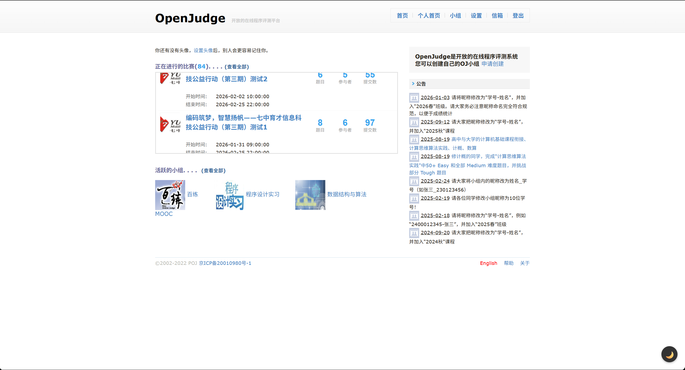
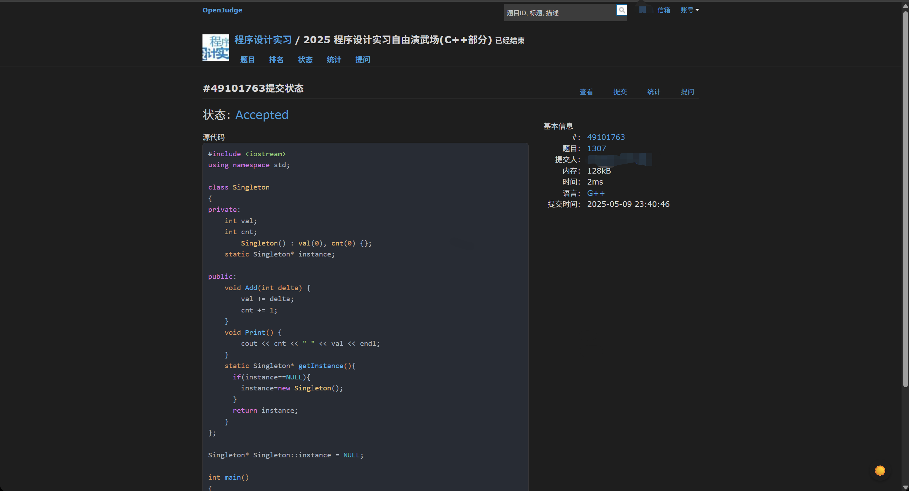
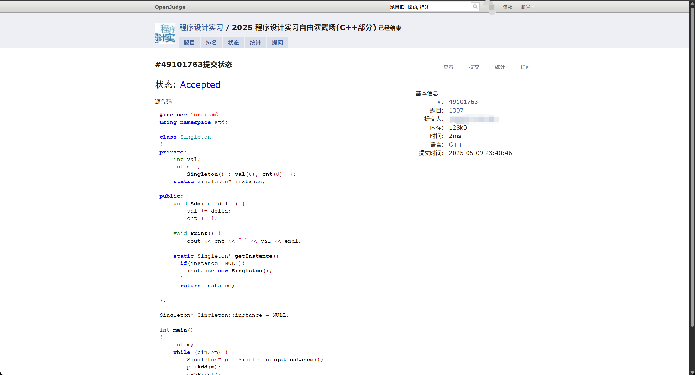
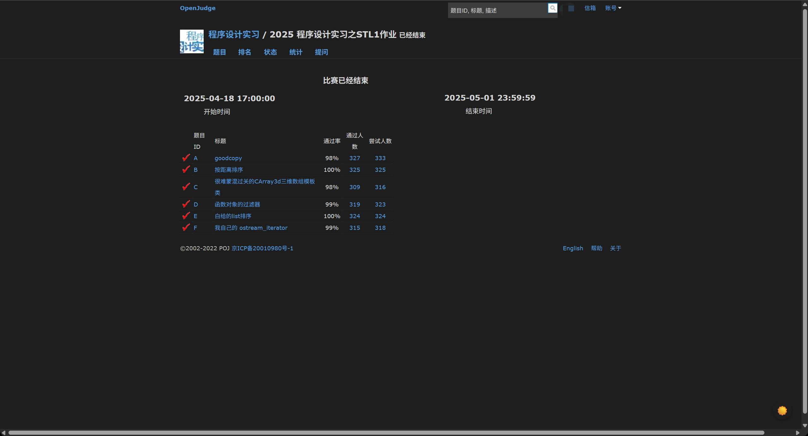
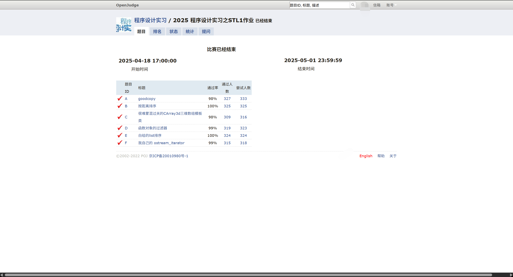

# OpenJudge-Art

这是一个为 [OpenJudge](http://openjudge.cn/) 在线判题平台设计的 Tampermonkey (油猴/篡改猴) 脚本。它不仅为熬夜刷题的你提供了保护视力的暗色主题，还贴心地加入了 LaTeX 数学公式渲染和专业级的代码高亮功能。

## ✨ 主要功能

- **🌗 沉浸式暗色主题**：
  - 全局深色背景 (`#1e1e1e`)，精心适配文字颜色，长时间阅读不累眼。
  - 强力去除各种顽固的白色背景块、背景图和渐变色。

- **💻 专业代码高亮 (One Dark Pro)**：
  - 内置 **Highlight.js** 引擎，支持 C++、Python 等主流语言的语法高亮。
  - 采用深受开发者喜爱的 **One Dark Pro** 配色方案 (VS Code 风格)。
  - 关键字紫、字符串绿、变量红，让网页上的代码阅读体验媲美 IDE。

- **∑ KaTeX 公式渲染**：
  - 自动识别并渲染题目中的数学公式。
  - 支持 `$ ... $`, `$$ ... $$`, `\( ... \)`, `\[ ... \]` 等常见格式。
  - 智能避坑：自动跳过代码块中的 `$` 符号，防止误渲染代码变量。

- **🎚️ 便捷的一键开关**：
  - 页面右下角常驻悬浮按钮。
  - 点击 🌙/☀️ 即可秒切亮色/暗色模式。
  - 自动记忆你的选择，下次打开网页自动应用。

## � 效果预览

|          开启前           |          开启后           |
| :-----------------------: | :-----------------------: |
|  |  |
|  |  |
|  |  |

## �🚀 安装方法

### 第一步：安装脚本管理器
你需要先在浏览器中安装 **Tampermonkey** 扩展：
- [Chrome 商店](https://chrome.google.com/webstore/detail/tampermonkey/dhdgffkkebhmkfjojejmpbldmpobfkfo)
- [Edge 商店](https://microsoftedge.microsoft.com/addons/detail/tampermonkey/iikmkjmpaadaobahmlepeloendndfphd)
- [Firefox Add-ons](https://addons.mozilla.org/zh-CN/firefox/addon/tampermonkey/)

### 第二步：安装脚本
1. 点击浏览器扩展栏的 Tampermonkey 图标，选择 **“添加新脚本...”**。
2. 删除编辑器中所有默认生成的代码。
3. 打开本项目中的 [Openjudge-Art.user.js](./Openjudge-Art.user.js) 文件，复制全部代码。
4. 粘贴到编辑器中，按 `Ctrl + S` 保存。

## 📖 使用说明

1. 脚本安装完成后，打开 OpenJudge 旗下的任意子站点（如 `dsa.openjudge.cn`）。
2. 页面默认会根据你的上次设置（首次默认为暗色）加载主题。
3. 可以在右下角找到控制按钮进行切换。

## 🛠️ 技术细节

- **样式覆盖**：针对 OpenJudge 古老的 `#siteBody`, `#siteHeader` 等结构进行了暴力去白和权重覆盖。
- **公式引擎**：通过 CDN 引入 [KaTeX](https://katex.org/) 库，快速渲染数学符号。
- **代码高亮**：集成 [Highlight.js](https://highlightjs.org/)，并注入自定义的 One Dark CSS 样式。

## 📝 更新日志

### v4.1
- 💅 **细节优化**：针对 Python 代码高亮配色进行了微调 (One Dark Pro Relaxed)。
- 🔴 修正了变量颜色过暖的问题，区分了内置函数 (Gold) 和普通变量 (Red)，视觉层次更清晰。

### v4.0
- 🎨 **重磅更新**：新增基于 One Dark Pro 主题的代码高亮。
- 🔧 集成 Highlight.js，支持 C++、Python 等多种语言自动检测。

### v3.0
- 🎉 新增 KaTeX 数学公式自动渲染支持。
- 🐛 修复了代码块中变量被误认为公式的问题。

### v2.0
- ✨ 新增右下角浮动开关按钮。
- 💾 实现本地存储记忆功能 (Local Storage)。

### v1.x
- 🚧 逐步完善暗色样式的覆盖范围。
- 🔧 修复顶部导航栏、侧边栏白框、代码块看不清等问题。

## 📄 License

MIT
